### Step1
> Windows用户请点击：[OpenConnect VPN客户端(适用：Windows 10/8/7系统)](http://inc.sysu.edu.cn/sites/inc.sysu.edu.cn/files/upload/download/openconnect-gui-1.5.1-win.zip)

### Step2
> 以Openconnect Windows版为例：
> 下载完解压包并解压之后，双击安装包出现：

> 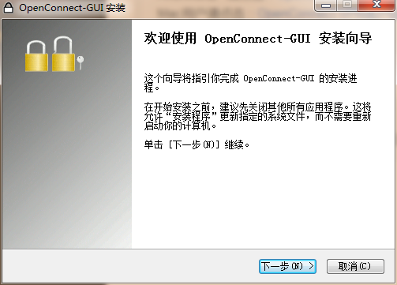
> * **点击下一步**

> 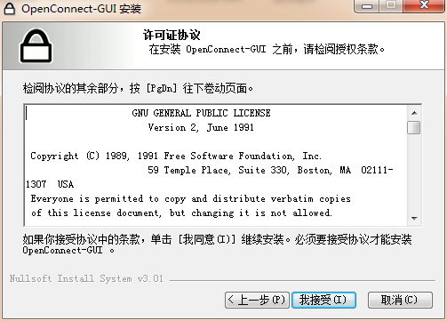
> * **点击我接受**

> 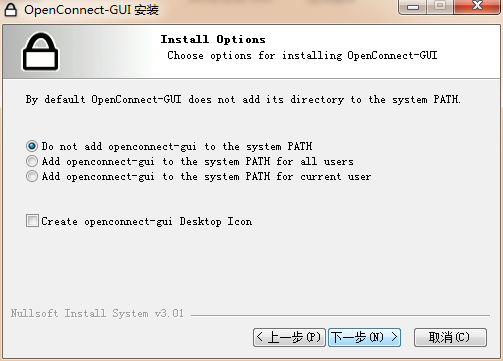
> * **点击下一步**

> 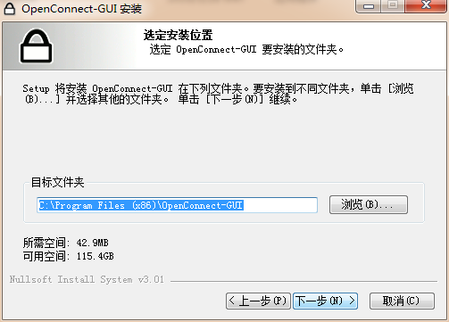
> * **点击下一步**

> 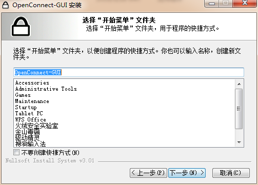
> * **点击下一步**

> 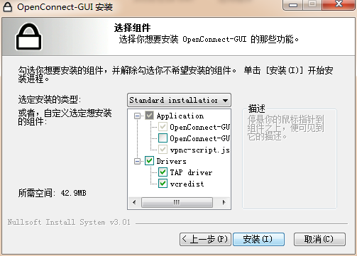
> * **点击安装**

> 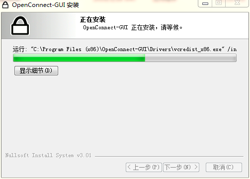

> 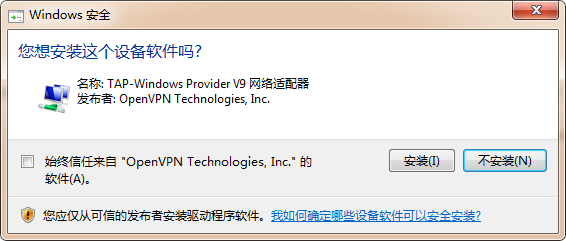
> * **点击安装**

> 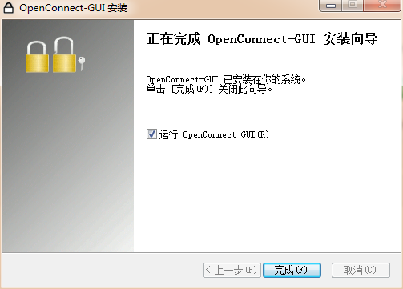
> * **点击完成**

### Step3
> 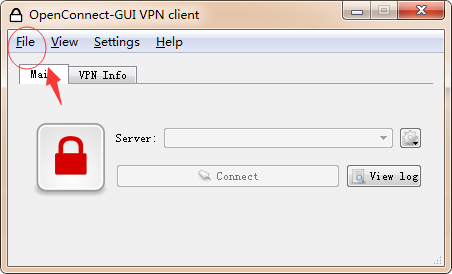
> * **点击左上角File**

> 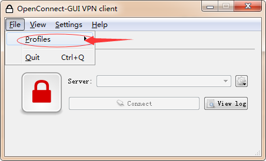
> * **并选择new profile**

> 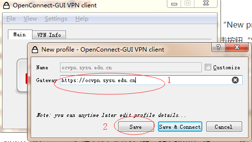
> * **在Getaway中输入https://ocvpn.sysu.edu.cn ，并点击save**

> 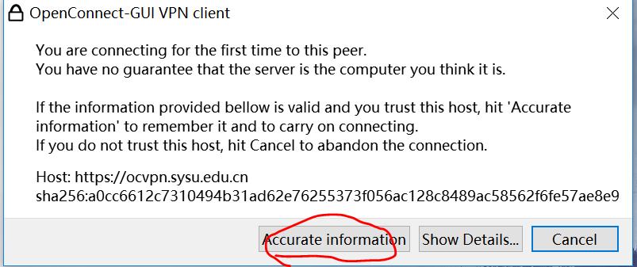

> 
> * **输入netID**

> 
> * **输入密码**

> 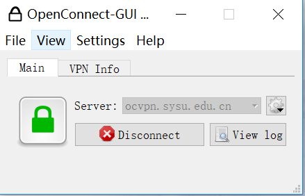
> * **等待一分钟会看到小锁标志变成绿色代表连接成功**
